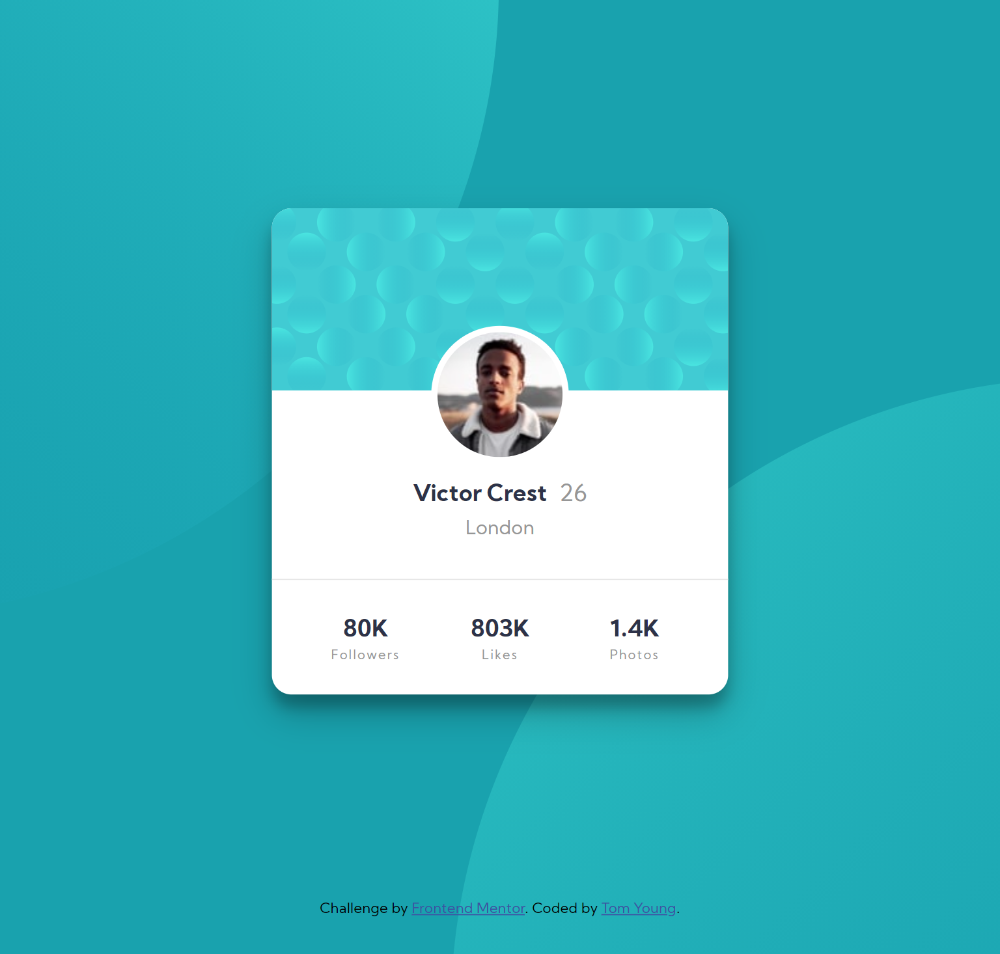

# Frontend Mentor - Profile card component solution

This is a solution to the [Profile card component challenge on Frontend Mentor](https://www.frontendmentor.io/challenges/profile-card-component-cfArpWshJ). Frontend Mentor challenges help you improve your coding skills by building realistic projects.

## Table of contents

- [Overview](#overview)
  - [The challenge](#the-challenge)
  - [Screenshot](#screenshot)
  - [Links](#links)
- [Author](#author)

**Note: Delete this note and update the table of contents based on what sections you keep.**

## Overview

### The challenge

- Build out the project to the designs provided

### Screenshot

### Links

- Solution URL: [Front End Mentor](https://www.frontendmentor.io/solutions/profile-card-component-using-html-and-sass-0sAAImJAA)
- Live Site URL: [GitHub Page](https://thethomasy.github.io/ProfileCardComponent_FrontEndMentor/)

## Author

- Frontend Mentor - [@TheThomasY](https://www.frontendmentor.io/profile/TheThomasY)
